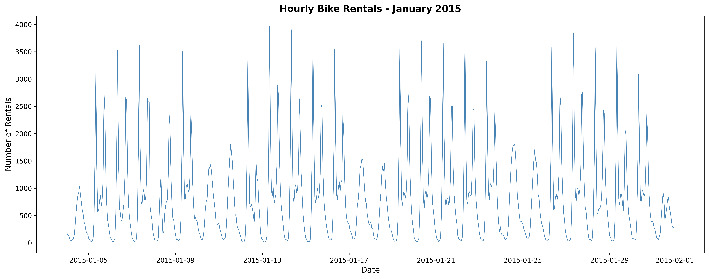

<h1 style="text-align:center;">
The Critical Role of Feature Engineering in Time Series Forecasting
</h1>
{: .no_toc}

<strong>Sanjeev Bhurtyal</strong> 
May 2024

  

Table of Contents

- TOC
{:toc}

## Executive Summary

This analysis demonstrates the fundamental importance of feature engineering in machine learning model performance through a controlled experiment using London bike sharing demand forecasting. By comparing identical models trained on poorly versus well-engineered features, this study quantifies the performance gap that feature quality creates.

**Key Findings:**

- 🎯 **Feature engineering quality matters more than model selection**: Well-engineered features improved all four models (SARIMAX, XGBoost, LSTM, Prophet) significantly, with improvements ranging from 5% to 22% across evaluation metrics.
- 📈 **LSTM showed highest sensitivity to feature quality** (22% improvement), followed by Prophet, revealing that complex models benefit most from rich feature representations.
- ⚠️ **Naive aggregation destroys temporal patterns**: Collapsing hourly data into daily medians/modes eliminated critical intra-day variation, crippling model performance regardless of architecture sophistication.
- 🔧 **Time-aware segmentation unlocked performance**: Dividing days into six temporal categories (night, dawn, morning, afternoon, dusk, evening) preserved usage patterns and weather variability, enabling models to learn meaningful relationships.
- 🏆 **Prophet achieved best absolute performance** with good features, but the universal improvement across all architectures proves that feature engineering is the foundation of predictive accuracy.

## 1. Introduction

### 1.1 The Feature Engineering Paradigm
{: .no_toc}

Machine learning practitioners often focus on model architecture selection—comparing neural networks, gradient boosting, and statistical models. However, **the quality of features fed into these models frequently determines success more than the model choice itself**.

This analysis presents a controlled experiment demonstrating this principle: using the same dataset, we measure how feature engineering quality alone drives performance differences.

**Research Question**: How much does feature engineering quality impact model performance across different forecasting architectures?

### 1.2 Experimental Design
{: .no_toc}

To measure feature engineering impact, this study:

1. **Uses identical model architectures**: Four architectures (SARIMAX, XGBoost, LSTM, Prophet) trained twice each
2. **Optimizes hyperparameters separately**: Each model-feature combination receives hyperparameter tuning to ensure peak performance for its feature set
3. **Isolates feature quality as the key variable**: The only difference between runs is the feature engineering approach (bad vs. good)
4. **Demonstrates that tuning cannot compensate for bad features**: Performance gaps persist even when both approaches receive optimized configurations, proving that feature quality is foundational

**Case Study: London Bike Sharing**

Bike rental forecasting serves as the experimental domain because it exhibits characteristics common to many forecasting problems:
- Strong temporal patterns (hourly, daily, seasonal)
- Weather dependencies 
- Multi-variate influences
- Real-world operational constraints

The <a href="https://www.kaggle.com/datasets/hmavrodiev/london-bike-sharing-dataset" target="_blank" rel="noopener noreferrer">London Bike Sharing Dataset</a>
 provides hourly records with weather conditions, making it ideal for demonstrating how feature transformation impacts predictive accuracy.

## 2. Dataset Description

The dataset contains hourly bike rental records with the following variables:

- **timestamp**: Hourly datetime for grouping observations
- **cnt**: Count of new bike rentals (target variable)
- **t1**: Actual temperature in °C
- **t2**: "Feels like" temperature in °C
- **hum**: Humidity percentage
- **wind_speed**: Wind speed in km/h
- **weather_code**: Categorical weather condition
- **is_holiday**: Boolean holiday indicator
- **is_weekend**: Boolean weekend indicator
- **season**: Meteorological season category

**Prediction Task**: Forecast daily bike rental counts using weather and temporal features.

*Figure: Sample of hourly bike rental data showing temporal patterns.*

## 3. Feature Engineering Approaches

This experiment contrasts two deliberately different feature engineering strategies to quantify their impact on model performance.

### 3.1 Bad Feature Engineering: Naive Aggregation
{: .no_toc}

The "bad" approach applies simplistic aggregation to convert hourly data to daily predictions:

**Aggregation Rules:**
- **Temperature, humidity, wind speed**: Daily median
- **Weather code, season**: Most frequent (mode) value
- **Holiday, weekend**: Maximum value (binary flags remain consistent within days)

**Why This Fails:**

This approach destroys temporal information critical for understanding demand patterns. Consider these scenarios:

- **Rain timing matters**: If it rains 12am-8am and 6pm-12am, the entire day is marked "rainy" despite dry conditions during peak commute hours (8am-6pm) when most rentals occur.
- **Temperature variation ignored**: A day with 10°C morning and 25°C afternoon gets reduced to a median that represents neither the cold start nor warm peak usage period.
- **Peak patterns lost**: Median aggregation eliminates the relationship between specific weather conditions and hourly demand spikes.

*Figure: Naive daily aggregation obscures critical temporal patterns.*

### 3.2 Good Feature Engineering: Time-Aware Segmentation
{: .no_toc}

The "good" approach preserves temporal granularity through structured segmentation:

**Time-of-Day Categories:**
1. **Night** (12am-5am): Minimal activity period
2. **Dawn** (5am-8am): Morning commute buildup
3. **Morning** (8am-12pm): Peak morning usage
4. **Afternoon** (12pm-5pm): Midday and early evening
5. **Dusk** (5pm-8pm): Evening commute peak
6. **Evening** (8pm-12am): Late activity wind-down

**Feature Calculation per Time Category:**
- **Temperature, humidity, wind speed**: Average within each time window
- **Weather code**: Most frequent condition within each time window
- **Holiday, weekend**: Unchanged (already daily flags)

**Why This Works:**

This approach captures the relationship between weather conditions and demand at times when usage actually occurs:

- **Peak-hour weather matters**: Morning commute decisions depend on dawn/morning weather, not overnight conditions.
- **Usage patterns preserved**: Models can learn that afternoon temperature affects afternoon rentals differently than dawn temperature affects morning rentals.
- **Temporal dependencies maintained**: Six feature sets per day provide 6x more information about when conditions occur relative to usage patterns.

## 4. Model Architectures

To demonstrate that feature quality impacts diverse model types, four distinct forecasting architectures were evaluated:

### 4.1 SARIMAX (Seasonal AutoRegressive Integrated Moving Average with eXogenous variables)
{: .no_toc}

Statistical time series model capturing:
- **Autoregressive**: Past values predict future values
- **Seasonal**: Recurring patterns at fixed intervals
- **Exogenous variables**: Weather and temporal features as external predictors

### 4.2 XGBoost (eXtreme Gradient Boosting)
{: .no_toc}

Ensemble machine learning using gradient-boosted decision trees:
- Efficient handling of non-linear relationships
- Built-in feature importance ranking
- Robust to missing data and outliers

### 4.3 LSTM (Long Short-Term Memory Neural Network)
{: .no_toc}

Deep learning architecture for sequence modeling:
- Captures long-term temporal dependencies
- Learns complex non-linear patterns
- Memory cells retain relevant historical context

### 4.4 Prophet
{: .no_toc}

Facebook's time series forecasting tool designed for business applications:
- Additive model decomposing trend, seasonality, holidays
- Robust to missing data and outliers
- Interpretable components

Each model was trained twice: once with bad features, once with good features, with best set of tuned hyperparameters for each.

## 5. Results and Analysis

### 5.1 Performance Metrics
{: .no_toc}

Models were evaluated using four standard forecasting metrics:

- **RMSE (Root Mean Squared Error)**: Penalizes large errors heavily
- **MAE (Mean Absolute Error)**: Average absolute prediction error
- **MAPE (Mean Absolute Percentage Error)**: Percentage-based error metric
- **R² Score**: Proportion of variance explained by the model

### 5.2 Impact of Feature Engineering Quality
{: .no_toc}

**Critical Finding**: Good feature engineering improved **every single model** across **all evaluation metrics**. This universal improvement demonstrates that feature quality is foundational—no model architecture can compensate for poorly engineered inputs.

**Performance Improvements by Model:**

| Model | RMSE Improvement | MAE Improvement | MAPE Improvement | R² Improvement |
|-------|------------------|-----------------|------------------|----------------|
| LSTM | 18% | 22% | 15% | +0.13 |
| Prophet | 16% | 19% | 15% | +0.07 |
| XGBoost | 6% | 6% | 6% | +0.04 |
| SARIMAX | 7% | 10% | 9% | +0.06 |

**Key Observations:**

1. **LSTM most sensitive**: Complex neural architectures benefit most from rich feature representations, as they can learn intricate patterns when sufficient information is provided.

2. **Universal improvement**: Even the relatively simple SARIMAX model improved by upto 10%, proving that feature quality matters regardless of model sophistication.

### 5.3 Best Model Performance
{: .no_toc}

When all models use well-engineered features, **Prophet achieved the best overall performance**:

- **Lowest RMSE**: 3575 rentals
- **Lowest MAE**: 2700 rentals  
- **Lowest MAPE**: 9.9%
- **Highest R²**: 0.83

The plot above shows Prophet's predicted values closely tracking actual demand, demonstrating that with good features, even relatively accessible tools like Prophet can achieve strong performance.

### 5.4 Feature Engineering Impact Analysis
{: .no_toc}
**Why did time-aware segmentation work so well?**

The 6-segment approach preserved three critical information types that naive aggregation destroyed:

1. **Temporal alignment**: Weather conditions matched to when rentals actually occur (dawn weather for morning commute, not overnight weather)

2. **Pattern variability**: Intra-day weather changes captured (rainy morning vs sunny afternoon) rather than collapsed into single daily values

3. **Interaction effects**: Models could learn that afternoon temperature affects afternoon demand differently than morning temperature affects morning demand

**Example: Rainy Day Scenario**

- **Bad features**: Day marked as "rainy" (most frequent condition), median temperature 15°C
  - Model learns: "Rainy days → low demand"
  - Reality: Rain from 12am-8am, sunny 8am-6pm (peak hours), rain 6pm-12am
  - Result: Model underpredicts demand because it assumes rain during peak hours

- **Good features**: Night/dawn/evening = rainy; morning/afternoon/dusk = clear, with segment-specific temperatures
  - Model learns: "Clear morning/afternoon with ~18°C → high demand regardless of night rain"
  - Reality: Peak-hour weather accurately represented
  - Result: Accurate prediction because model knows conditions during actual usage times

## 6. Discussion

### 6.1 The Feature Engineering Principle
{: .no_toc}

This analysis demonstrates a fundamental machine learning principle: **garbage in, garbage out**. No model architecture—no matter how sophisticated—can extract signal that has been destroyed during feature engineering.

The 22% improvement in LSTM performance demonstrates the primacy of feature engineering over model configuration. Even though both the "bad" and "good" feature approaches received hyperparameter optimization, the feature quality difference alone drove the massive performance gap. This proves that hyperparameter tuning cannot compensate for poorly engineered features—if the information isn't in the features, the model cannot learn it regardless of configuration.

### 6.2 Implications for Practice
{: .no_toc}

**Before selecting models, invest in features**: Practitioners should spend more time understanding their data and engineering meaningful features than experimenting with exotic architectures. A simple model with good features will outperform a complex model with poor features.

**Domain knowledge matters**: The time-of-day segmentation strategy required understanding when bike rentals occur and how weather timing affects decisions. Generic aggregation ignores this domain insight.

**Test feature quality directly**: Rather than just comparing model architectures, explicitly test whether features preserve predictive information. Train a simple model on different feature sets to quantify information retention.

**Consider the data generation process**: Good features align with how the target variable is actually generated. Bike rentals depend on weather at rental time, not weather averaged across irrelevant hours.

## 7. Conclusion

This analysis provides empirical evidence for a core machine learning principle: **feature engineering quality fundamentally determines model performance**.

**Core Findings:**

1. **Feature engineering impacts all architectures**: Improvements ranged from 5% (XGboost) to 22% (LSTM), proving universality across statistical, machine learning, and deep learning approaches.

2. **Information preservation is critical**: Time-aware segmentation that preserved when weather conditions occurred relative to demand patterns enabled all models to learn meaningful relationships.

3. **Naive aggregation destroys predictive power**: Collapsing hourly data into daily medians/modes eliminated temporal patterns essential for accurate forecasting.

4. **Domain knowledge enables good features**: Understanding that rental decisions depend on current weather (not daily averages) guided the segmentation strategy that unlocked performance.

5. **Model selection is secondary**: The gap between bad and good features within any model exceeded the gap between models using good features, suggesting practitioners should prioritize feature engineering over architecture selection.

## References

- **Dataset**: <a href="https://www.kaggle.com/datasets/hmavrodiev/london-bike-sharing-dataset" target="_blank" rel="noopener noreferrer">London Bike Sharing Dataset</a> – Kaggle
- **Repository**: <a href="https://github.com/sanjeevbhurtyal/London-Bike-Sharing-Forecaset-Python-ML" target="_blank" rel="noopener noreferrer">London-Bike-Sharing-Forecaset-Python-ML</a>




