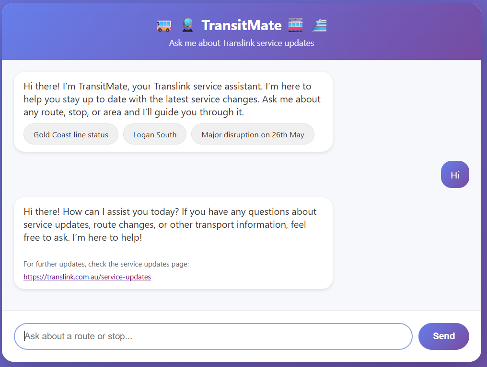
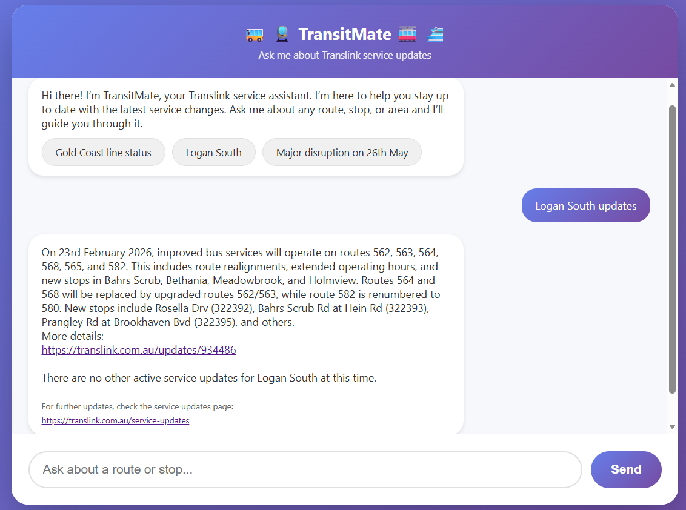
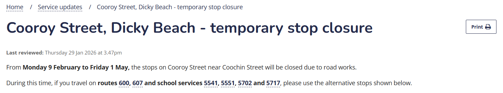
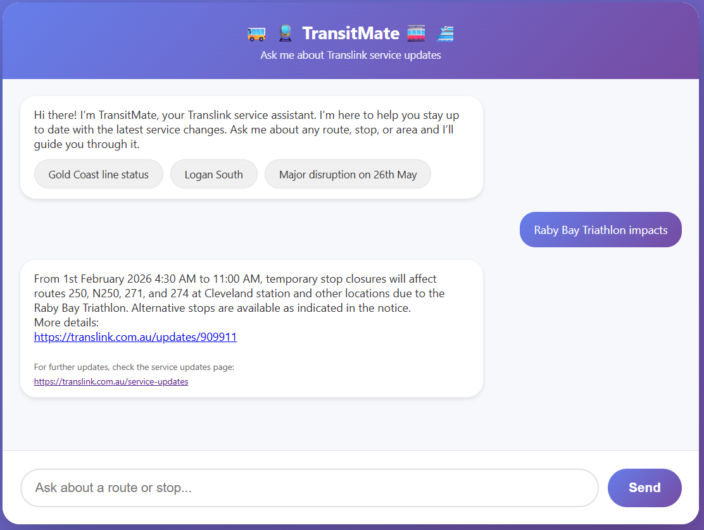
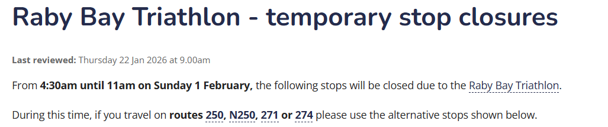
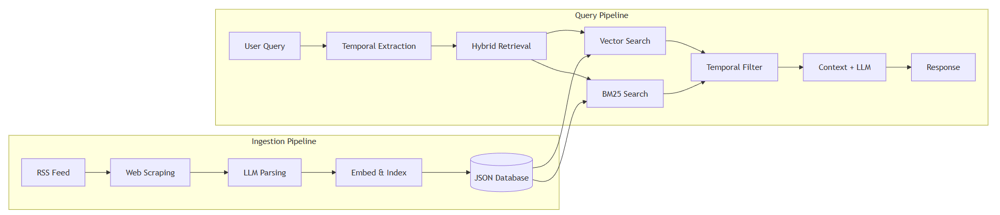

<h1 style="text-align:center;">
  TranistMate - Translink Service Update Chatbot
</h1>
{: .no_toc}

<strong>Sanjeev Bhurtyal</strong> 
January 2026

  

Table of Contents

- TOC
{:toc}

---

## Overview

Transport networks operate dynamically, and staying informed about service disruptions presents an ongoing challenge for commuters and transport planners alike. While TransLink regularly updates service status through website notices and RSS feeds, extracting specific information about particular routes or stations from these fragmented sources remains time-consuming and inefficient.

        
  Figure: Translink Service Updates

**TransitMate** addresses this information fragmentation through an intelligent conversational AI system. Leveraging Retrieval-Augmented Generation (RAG), it delivers real-time, context-aware responses to natural language queries about disruptions, track closures, and stop impacts across the TransLink network.

### Key Benefits for Planners & Modellers
{: .no_toc}
- **Rapid Data Access**: Query current service impacts instantly without manual navigation through multiple web pages
- **Structured Insight Extraction**: Automatically parses unstructured transit notices into actionable summaries.
- **Enhanced Search Accuracy**: Combines keyword search with semantic understanding to ensure no critical disruption is missed.

---

## Examples in Action

TransitMate enables users to query the transit network using natural language, receiving clear, concise summaries of service impacts.

  
   
  Figure: Interactive Chatbot Interface

### Common Use Cases
{: .no_toc}
<table align="center">
  <tr>
    <td align="center" width="50%" style="padding:0.5%;">
      

        
        
        <strong>Figure: Location-Based Queries</strong> 
      

    </td>
    <td align="center" width="50%" style="padding:0.5%;">
      

        
        
        <strong>Figure: Route-Specific Impacts</strong> 
      

    </td>
  </tr>
  <tr>
    <td align="center" width="50%" style="padding:0.5%;">
      

        
        
        <strong>Figure: Stop Accessibility</strong> 
      

    </td>
    <td align="center" width="50%" style="padding:0.5%;">
      

        
        
        <strong>Figure: Event Impact Analysis</strong> 
      

    </td>
  </tr>
</table>

---

## How it Works

        
  Figure: System Architecture Overview

The system operates as a continuous pipeline that transforms raw transit notices into a searchable, semantically-enriched knowledge base.

### 1. Data Ingestion & Enrichment
{: .no_toc}
The pipeline monitors official Translink RSS feeds and scrapes detailed service update pages. It doesn't just collect text; it uses AI to **extract structured metadata** such as:

- Affected routes and stops
- Start and end dates
- Geographic locations

### 2. Intelligent Knowledge Base
{: .no_toc}
Information is stored in a specialized "Vector Store" that allows the system to understand the meaning of a query, not just exact keywords. This means it can connect "closures" with "disruptions" or "track work" automatically.

### 3. Contextual Query Engine
{: .no_toc}
When a user asks a question, the system:

1. **Analyzes the timeframe**: Identifies if the user is asking about "today", "next week", or a specific date.
2. **Retrieves Relevant Notices**: Performs a hybrid search to find the most accurate notices based on both keywords and context.
3. **Generates Human-Like Responses**: Summarizes the technical details into a clear, professional answer with official links for further detail.

---

## Technical Implementation

While designed for planners, the system is built on a robust, privacy-focused tech stack:

- **Local Intelligence**: Powered by local Large Language Models (LLMs) via Ollama, ensuring data processing remains local and secure.
- **Hybrid Retrieval**: Employs a combination of semantic and keyword search to ensure high precision in identifying specific transit routes and stops.
- **Micro-Backend**: A lightweight Flask-based backend handles data orchestration and real-time querying.

---




